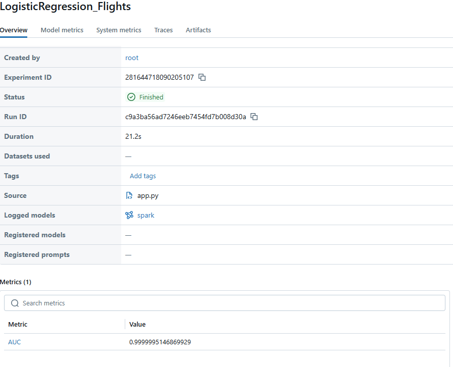

# Проект по предсказанию задержек авиарейсов

Этот проект демонстрирует полный MLOps-пайплайн для анализа данных об авиарейсах и предсказания вероятности их задержки. Проект построен с использованием Apache Spark, Delta Lake, MLflow и Docker.

## Ключевые технологии
*   **Контейнеризация:** Docker, Docker Compose
*   **Обработка данных:** Apache Spark
*   **Хранение данных:** Delta Lake 
*   **Отслеживание экспериментов:** MLflow

## Структура проекта
```
flight-delay-predictor/
├── data/
│   ├── bronze/     # Слой для сырых, необработанных данных
│   ├── silver/     # Слой для очищенных, обогащенных данных
│   └── gold/       # Слой для данных, готовых к анализу и ML
├── logs/
│   ├── output.log  # Логи выполнения приложения
│   └── mlruns/     # Артефакты и логи MLflow
├── src/
│   ├── app.py      # Основной код пайплайна
│   ├── run.sh      # Скрипт-обертка для запуска
│   └── 2018_small.csv # Исходные данные
├── Dockerfile          # Описание Docker-образа
├── docker-compose.yml  # Конфигурация для запуска сервиса
└── README.md           # Этот файл
```

## Архитектура данных 

*    **Bronze Layer:**
    *   Сырые данные загружаются из `2018_small.csv`.
    *   Данные сохраняются в формате Delta Lake с **партиционированием по дате (`FL_DATE`)**. Это значительно ускоряет запросы по диапазонам дат.

*    **Silver Layer:**
    *   Данные очищаются: удаляются отмененные и перенаправленные рейсы.
    *   Создается целевая переменная `is_delayed` (1, если задержка > 15 мин, иначе 0).
    *   Пропуски в числовых данных заполняются средними значениями.
    *   Для оптимизации дальнейшей обработки данные **перепартиционируются (repartition)**.
    *   Для ускорения аналитических запросов таблица **оптимизируется с помощью `Z-ORDER`** по колонкам `ORIGIN` и `DEST`.

*    **Gold Layer:**
    *   Данные полностью подготавливаются для обучения модели.
    *   Категориальные признаки преобразуются в числовые с помощью `StringIndexer`.
    *   Все признаки собираются в один вектор `features` с помощью `VectorAssembler`.

## Инструкция по запуску

#### Предварительные требования
*   **Docker**
*   **Docker Compose**
*   Для пользователей Windows: **WSL (Windows Subsystem for Linux)**

#### Шаг 1: Клонирование и подготовка
1.  Клонируйте или скачайте репозиторий на свой компьютер.
2.  Поместите в файл с данными `2018_small.csv` в папку `src/`.

#### Шаг 2: Подготовка скрипта запуска (для пользователей Windows/WSL)
Чтобы избежать проблем с форматом файла и правами доступа при работе в WSL, выполните две команды в терминале из корневой папки проекта:
```bash
# 1. Конвертируем окончания строк из формата Windows (CRLF) в Unix (LF)
dos2unix src/run.sh

# 2. Даем скрипту права на выполнение
chmod +x src/run.sh
```

#### Шаг 3: Сборка и запуск пайплайна
Выполните одну команду. Она автоматически соберет Docker-образ и запустит контейнер, который выполнит весь пайплайн.
```bash
docker-compose up --build
```
Выполнение займет несколько минут. Контейнер остановится автоматически после успешного завершения (`exited with code 0`).

## Проверка результатов

#### 1. Логи выполнения
Все шаги выполнения пайплайна, от инициализации Spark до логирования в MLflow, записываются в файл `logs/output.log`.
```bash
cat logs/output.log
```
В конце файла вы увидите сообщение `>>> Скрипт успешно завершен!`.

#### 2. Артефакты MLflow
Самое главное — это результат работы MLflow. Чтобы его увидеть, нужно запустить веб-интерфейс.

**Установка и запуск MLflow UI:**
```bash
# (Только если вы работаете в свежей Ubuntu/Debian, где pip защищен)
# Создаем и активируем виртуальное окружение
python3 -m venv venv
source venv/bin/activate

# Устанавливаем mlflow в это окружение
pip install mlflow

# Запускаем веб-интерфейс, указывая на папку с логами
mlflow ui --backend-store-uri ./logs/mlruns
```

Откройте в браузере `http://127.0.0.1:5000`, и вы увидите следующий результат, подтверждающий успешное выполнение:



На скриншоте видно, что:
- **Статус** выполнения — **`Finished`**.
- **Метрика `AUC`** успешно залогирована и показывает высокое качество модели.
- Сама **Spark-модель** сохранена как артефакт, готовый к использованию.
